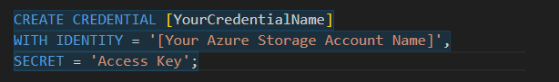
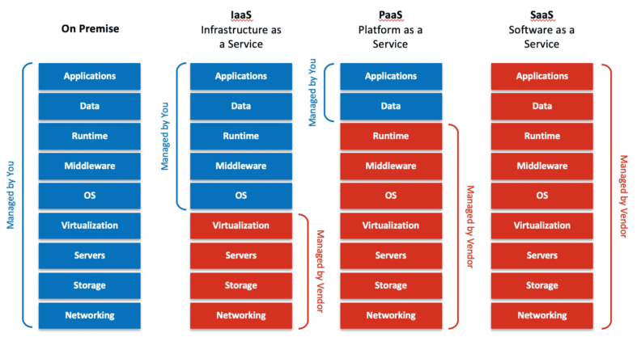
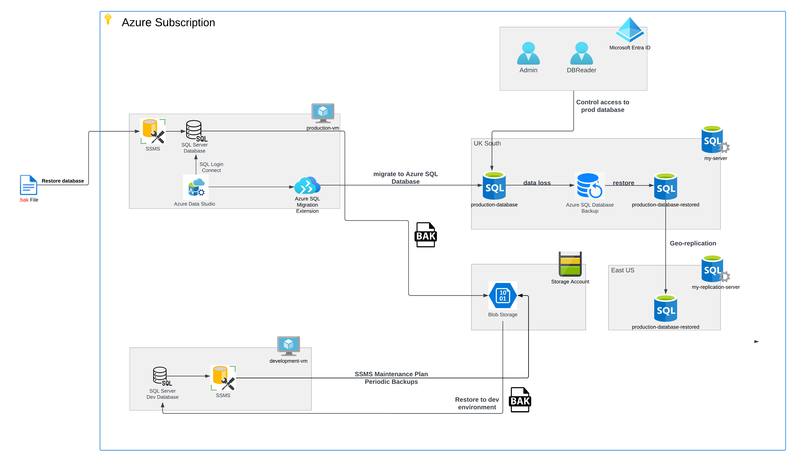

# Azure Database Migration Project
# Summary
This is part of the Cloud Engineer learning course. In this project, project manager would architect and implement a cloud-based database system on Microsoft Azure, showcasing author's hands-on expertise in cloud engineering.
# Project Prerequisites
For this project, different services on Microsoft Azure are used, therefore a login credential which allows to create different resources on Azure is needed. As this is part of the course, such info is provided.

For those who want to try out this process themselves, an Azure account will be required. To sign up for an Azure account, use this link https://azure.microsoft.com/en-us/get-started/azure-portal/ or https://azure.microsoft.com/en-us/free/ for a limited free account.
# Set up the Production Environment
### Set up the Windows Virtual Machine
Window Virtual Machine (VM) can be set up in Azure portal with "Create a resource" button. 
### Connect to the Windows Virtual Machine
Connecting to the Windows VM is simple, we first need to download the RDP file from the *Connect* section, then open this RDP file using different clients on different OS.
These include 
- *Remote Desktop Connection* on Windows OS.
- *Microsoft Remote Desktop app* on MacOS.
- Client like *Remmina* for Linux OS.
### Install SQL Server and SQL Server Management Studio (SSMS)
SQL Server is primarily designed to manage relational databases, which store data in structured tables with predefined relationships between them. In this project we use this to manage our on-premises database.

SQL Server installer can be downloaded from Microsoft from link below. Installation itself is simple and straightforward, just follow the on-screen dialogue. 

https://go.microsoft.com/fwlink/p/?linkid=2215158&clcid=0x809&culture=en-gb&country=gb

SSMS is a powerful graphical user interface (GUI) tool provided by Microsoft for managing SQL Server instances and databases. It serves as a central hub for database administrators and developers to perform various tasks related to SQL Server.

SSMS installer can be downloaded from link below. Just follow on-screen dialogue to finish installation process.

 https://learn.microsoft.com/en-us/sql/ssms/download-sql-server-management-studio-ssms?view=sql-server-ver16#download-ssms

### Create the Production Database 
The production Database is created by restoring from this backup file https://aicore-portal-public-prod-307050600709.s3.eu-west-1.amazonaws.com/project-files/93dd5a0c-212d-48eb-ad51-df521a9b4e9c/AdventureWorks2022.bak

The restoring process was carried out using *Restore Database* function in SSMS while connect to the SQL Server instance.

# Migrate to Azure SQL Database
We now have setup our on-premises database, we can move to transitioning our database to Azure's cloud ecosystem by migrating to an Azure SQL Database.
### Set up Azure SQL Database
Azure SQL database is required in this project, this serves as the target for migrating our on-premises database. This was created on Microsoft Azure together with a SQL database server both are under the same resource group.

Our SQL database server uses the *SQL Server Authentication* method where an user and password was created for login.

Since this is only a project to demonstrate database migration, the service and compute tier requirement is low, hence *Basic* service tier was selected to minimise the cost. 

After the creation of the database, a connection test was performed with VSCode to ensure database is working properly. This requires.

- SQL Server extension on VSCode is installed
- *Public network access* in server firewall must be set to *Selected networks*
- Azure login account must be added onto VSCode
- Client IP address range (start IP and end IP) must be added to the firewall rule.

*Notice that when adding a new connection on VSCode, the database name must be the same as the one on Azure, otherwise the connection will fail. It may look optional when shown, but is NOT optional.*

### Prepare for Migration
Here we use Microsoft's Azure Data Studio as the tool to manage the migration process. This piece of database management tool was installed on the VM created earlier and connected to on-premises database also set up on the VM. For on-premises database, we use "localhost" as Server Name and with *Windows Authentication* as Authentication type.

### Connect to Azure SQL Database
Apart from the on-premise database, Azure Data Studio also used to connect to the newly created Azure database using "SQL Login" authentication type with credentials created earlier when setting up Azure SQL Database. With these two database connected to the same tool, schema comparison and data migration can be executed. 

### Schema Migration
Before migrating the data, we need to process schema migration first. Luckily this can be done with *SQL Server Schema Compare* extension on Azure Data Studio. In this project, this extension was used to compare the schema on the source (on-premise) database and target (Azure SQL) database. Schema migration was followed after comparison was done.

### Data Migration
With schema compared and migrated, we are now ready to migrate data. This is done with Azure SQL Migration extension within Azure Data Studio. Once the extension is installed, Azure SQL Migration option can be found under "Manage" option of the database. 

The migration process itself is straightforward, it checks for compatibility of the source and target database and provide recommendations for target type. In our case, we have used Azure SQL Database type.

Notice that during the process, Azure Account login credentials may have to be entered a couple of times to allow Azure Data Studio to access the info like database server and resource group etc.

It is also necessary to have an "Azure Database Migration Service" which orchestrates database migration activities and tracks their progress. One can use existing Database Migration Service if already have one, or create a new one in one of the data migration steps or simply create new one on Azure portal.

After going through all the steps, data migration will begin. Depends on the size of the database, this can take a while to complete. Once done, migration status is shown in Azure SQL Migration pane.

### Validate Migration Success
Database migration validation was carried out with manually compare a couple of top rows on three different tables, all rows checked were ok.

Also Microsoft Visual Studio was used to perform a more comprehensive validation by checking through every row of data on every table migrated and it turns out that apart from DatabaseLog table, all other tables have been migrated without problem. It has later been determined that the content of DatabaseLog does not affect the integrity or functionality of the database, the log change can in fact due to the migration process, therefore the whole migration has been successful.

# Data Backup and Restore
We now look at different ways of backup data.
### Backup the On-Premise Database
The on-premises database is backup using SQL Server Management Studio (SSMS). The process is straightforward, just pick the desired database and select Back Up from Tasks menu. Then followed by making sure type of backup i.e. Full back up or differential backup, and choose the location to store the backup file and give backup file a meaningful name and start the backup. In this case, our backup file is stored in SSMS's default backup folder.

### Upload Backup to Blob Storage
To use Azure Blob Storage, a Storage Account on Azure is required. This can be obtained from Azure with Create Resource and select Storage Account. Once Storage Account is available, a storage container is also needed to store the backup file.

### Restore Database on Development Environment
The reason for Development Environment is that developers can run tests on such environment without causing any issue on production environment. Setting up Development Environment is straightforward; it is basically the same as production environment but on another virtual machine. In this case, we have used the backup file created above to restore database on this development environment.

### Automate Backups for Development Database
Automate backups provide better data security than manual backups as it takes out the human intervention and potential human error.
With the functionality of SSMS, this can be achieved easily. Functions required in SSMS
- SQL Server Agent
- Maintenance Plan under Management group
- SQL Server Credential - This is done with query window using codes below, where *[YourCredentialName]* is any descriptive name given to the credential, *[Your Azure Storage Account Name]* and *Access Key* both can be found on your Azure Storage Account.

We have successfully created and tested regular auto backup plan. Our backup plan involves backup once a week at 1am in the morning to ensure no impact to potential usages.

# Disaster Recovery Simulation
We perform a disaster recovery simulation by intentionally mimicking data loss in production environment.
### Mimic Data Loss in Production Environment
In our production database, there is a table named Production.WorkOrder which contains the work order details including OrderQty, StartDate, EndDate and DueDate ect. In this sumulation we will simulate part of this table been deleted deliberately to make the production performance look better.

There are total of 72591 rows of data on this table, 4727 work orders are more than 14 days overdue. Someone decided to change EndDate on all these rows to just 12 days overdue so the overall performance may look slightly better. There is 0 row with 12 days overdue in original data.

After updating table, we now have 4727 rows with 12 days overdue.

UPDATE Production.WorkOrder
SET EndDate = DueDate + 12
WHERE EndDate - DueDate > 14;

### Restore Database from Azure SQL Database Backup
Thanks to the backup and Restore capability of Azure SQL Database, it is simple and straightforward to restore damaged database. This is done directly on Azure portal under the said database, just select Restore and pick the time and perform restore. Make sure picked time is just before data lost happened to allow recovery of all lost data while preserving.

After our restore was done, checks were done with Azure Data Studio, and new query result on the restored database shows the same result as original data. Restore test was success.

# Geo Replication and Failover
### Set Up Geo-Replication for Azure SQL Database
In this exercise, we have created a Geo Replication of our production SQL database. This is done on Azure from Geo Replica menu. (US) East US has been chosen as the region for our replicate database. This is because our primary server is in UK South and East US is geographically far enough compared with other locations in Europe.

Same as our primary server, our secondary server also uses SQL authentication as the authentication method for SQL login.

### Test Failover and Failback
As we have created our geo-replication database, we can now proceed to test failover and failback. Since our database is a dummy one, there is no real time traffic on it, the test was simply done with a push of a button on Azure followed by validating the connectivity to the replication database and data integrity. In a real-world scenario, such test is more complicated and the impacts of such action will have to be addressed before carried out the test. 

The goal is to ensure minimum impact to the users and real-time data which can be lost or damaged in term causing financial lost or reputational damage. Below are some important considerations:

- Downtime Window: Perform failover during a scheduled maintenance window or during periods of low user activity.

- Application Awareness: Ensure that applications are designed to handle failover scenarios, and any necessary configuration changes are made to point to the secondary region after the planned failover. In our case, we make sure connections to replication database works properly.

- Data Synchronization: Depending on the duration and data replication lag, there may be some data loss during the failover. We must understand the replication lag and potential data loss implications. In our case, this is almost negligible as no real-time data traffic presented.

- Read-Only Access: The secondary region, after the planned failover, will be in a read-write state. Adjust application behaviour accordingly to avoid unintended write operations.

Same principle applies when the failback is performed.

# Microsoft Entra Directory Integration
In order to allow a more organised way to manage assesses to our database, I have integrated Microsoft Entra Directory with our Azure SQL database. To do this, I have started by created an admin account that holds the authority to manage and oversee our production database. 

This is done under the database server pane >> Settings >> Microsoft Entra ID >> Set admin then followed by select user.

This admin account is then added to the Azure Data Studio and used to connect to our Azure SQL database. When connected to database, this admin account can be used to perform administrative tasks on the database. In our case, I have used this to grant the db_datareader role to a newly created user to test out whether db_datareader can modify our database. It turned out that the test was successful.

*Note: after switching connection from admin user to db_datareader user, SQLQuery tab opened by admin user login must be closed. If this is not closed and subsequently this tab is used by db_datareader or other none admin user accounts, administrative tasks can still be executed and cause intended/unintended change to database.*

# Conclusions

Diagram above shows the differences between each of cloud service models compare with On-Premises IT infrastructure.

This project demonstrates the transition from On-Premises service model towards IaaS and then PaaS model. When the database is managed solely on-premises, one entity has to manage applications, hardware, and data.

With the incorporation of virtual machine into our project, we effectively moved toward IaaS model where we only manage application, and data; Azure manages hardware. In this setup, the obvious advantage is that since we don't have to manage our own hardware, such costs can be removed from total operational cost.

When we migrate our database to Azure SQL Database, we effectively moved from IaaS further to PaaS where we only manage our data and applications, everything else is managed by IT service provider. This can also help in the reduction of the operational cost as well as quickened and simplified development process.

Chart above shows the project diagram for this particular project. Apart from the original database backup file, every step in the project requires an Azure Subscription. Each block represents a resource used under the project. These include Virtual Machines, Azure SQL Databases include the replication, Storage Account, and Microsoft Entra ID.
